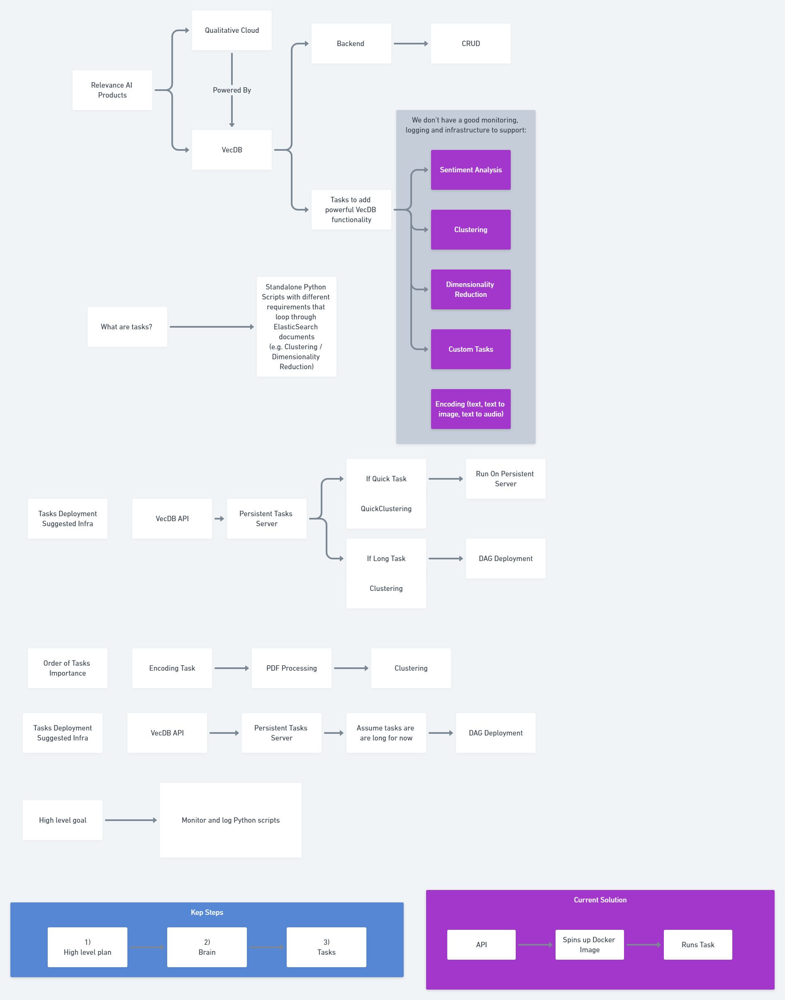
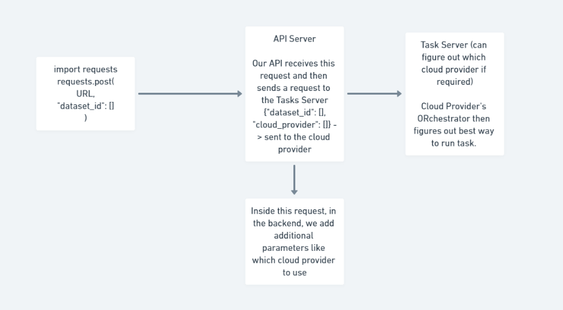
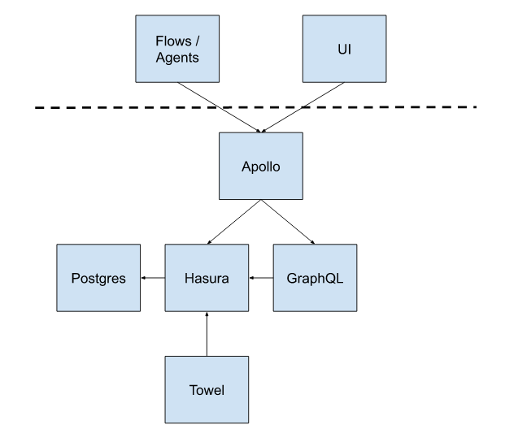

# MLOps Task Server with Prefect

<!--  -->



We aim to design a task server that can orchestrate variety of data processing and ML related tasks of priority ranking etc .. - 

1. Encoding
2. PDF Processing
3. Clustering
4. ML specific - Training(Finetuning)/Inference




## Prefect Architecture

Prefect Server is an open source backend that makes it easy to monitor and execute your Prefect flows. Under the hood, Prefect Server is actually a diverse collection of services that provide a persistent record of your runs, current state, and allow for asynchronous scheduling and notifications. It was designed to expose many of the popular developer features of Prefect Cloud in a way that allows for community contributions, collaborations and customisations. In particular, Prefect Server ships out-of-the-box with:

Prefect Server is composed of a few different services:

   - UI: the user interface that provides a visual dashboard for mutating and querying metadata
   - Apollo: the main endpoint for interacting with the server
   - PostgreSQL: the database persistence layer where metadata is stored
   - Hasura: the GraphQL API that layers on top of Postgres for querying metadata
   - GraphQL: the server's business logic that exposes GraphQL mutations
   - Towel: runs utilities that are responsible for server maintenance
   - Scheduler: schedules and creates new flow runs
   - Zombie Killer: marks task runs as failed if they fail to heartbeat
   - Lazarus: reschedules flow runs that maintain an unusual state for a period of time

Users and Agents only need access to the Apollo endpoint, all other services may reside behind a firewall.


## Getting started

```zsh
❯ make help
Available rules:

clean               Delete all compiled Python files 
install             Install dependencies in pyproject.toml (poetry.lock) 
lint                Lint using flake8 
update              Update dependencies in pyproject.toml 

```